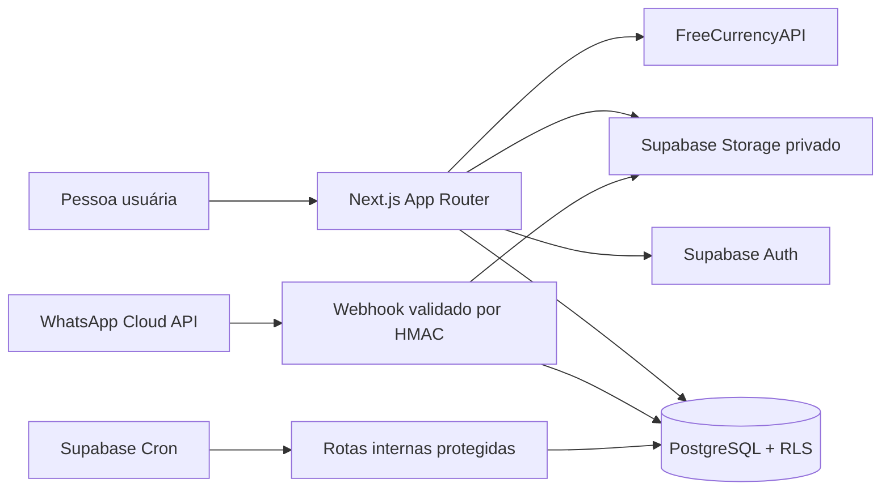
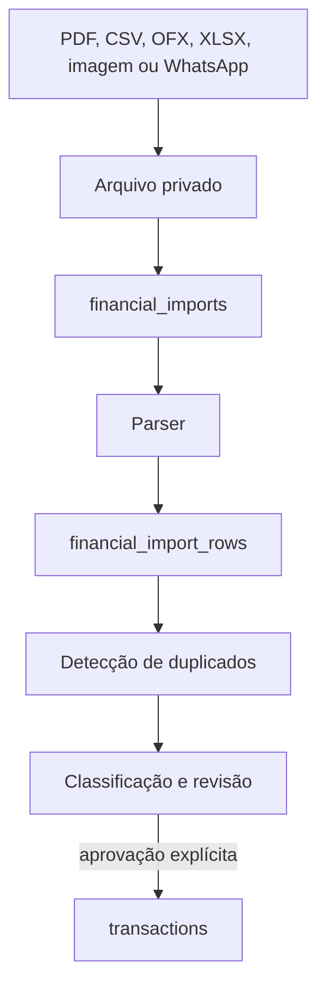

# AUREUM

Plataforma web de organização financeira para pessoas, casais e pequenos grupos que desejam reunir contas, cartões, transações, metas, investimentos e decisões financeiras em um único lugar.

> O AUREUM está em desenvolvimento ativo. Os dados da demonstração são fictícios. A fundação da V12 está implementada localmente, mas a migração, os jobs e o webhook ainda precisam ser ativados e validados no ambiente remoto.

## Visão do produto

O projeto começou como uma landing page e um dashboard demonstrativo. Evoluiu para uma aplicação financeira com autenticação, dados reais no Supabase, colaboração por núcleos financeiros, internacionalização e uma camada segura de ingestão de documentos.

Os três pilares da experiência são:

- **Amor:** organizar dinheiro sem perder de vista as pessoas e os objetivos compartilhados;
- **Ordo:** transformar movimentações dispersas em informação estruturada;
- **Progressus:** acompanhar evolução, metas e patrimônio ao longo do tempo.

## Estado atual

### Implementado

- aplicação em Next.js, App Router, React e TypeScript;
- landing page e páginas institucionais responsivas;
- autenticação, cadastro, confirmação de e-mail e perfil;
- núcleos financeiros com criação, convite por código, solicitação de entrada e papéis de acesso;
- dashboard mensal alimentado pelo Supabase;
- transações, categorias, metas, contas, cartões, investimentos e aprovações;
- demonstração isolada com dados fictícios;
- idiomas PT-BR, EN-US e EN-GB;
- temas claro, escuro e alto contraste;
- navegação adaptada a desktop, tablet e celular;
- cotações com base em BRL, cache no banco e sincronização interna protegida;
- validação local de CPF/CNPJ e integração opcional preparada para provedor oficial;
- perfil com telefone internacional, endereço, data de nascimento e avatar privado;
- metadados padronizados no formato `AUREUM | Página`;
- base V12 para upload de extratos, faturas e documentos financeiros;
- associação do WhatsApp por código temporário e webhook com validação HMAC;
- fila assíncrona, deduplicação e staging antes da criação de transações.
- pop-up de carregamento durante a autenticação;
- footer institucional reutilizável em landing, marketing e autenticação;
- páginas de Termos de Uso, Privacidade/LGPD, Preços e Central de Ajuda em PT-BR e inglês;
- catálogo selecionável de instituições brasileiras e internacionais comuns;
- recorte de avatar em 3:4 antes do armazenamento privado;
- área de importações com upload, revisão, rejeição e aprovação idempotente para `transactions`.

### Implementado localmente, com ativação remota pendente

- migração da V12 no Supabase;
- bucket privado `financial-imports`;
- webhook da Meta para WhatsApp Cloud API;
- worker periódico de importações;
- jobs de cotações, processamento e limpeza;
- validação ponta a ponta com arquivos e mensagens reais.

### Planejado

- parsers de OFX, PDF, XLSX e imagens, com OCR e classificação assistida;
- revisão jurídica e dados formais nos Termos de Uso e na Política de Privacidade/LGPD;
- definição comercial dos planos e canais oficiais da Central de Ajuda;
- Open Finance como etapa posterior à importação documental;
- definição de planos, cobrança, suporte e operação comercial.

## Arquitetura



### Princípios de domínio

- **Núcleo financeiro:** espaço compartilhado que substitui o termo visível “household”. Os nomes internos `household_*` foram preservados para evitar uma migração destrutiva.
- **Menor privilégio:** acesso aos dados é controlado por autenticação, participação no núcleo e políticas RLS.
- **Proposta antes da confirmação:** contribuidores podem propor lançamentos; administradores aprovam o que se torna oficial.
- **Importação em staging:** documento recebido nunca deve criar transações oficiais automaticamente.
- **Segredos somente no servidor:** chaves administrativas, tokens de webhook e segredos de workers não recebem o prefixo `NEXT_PUBLIC_`.

## Fluxo da V12



O parser inicial aceita CSV e TXT. PDF, OFX, XLSX e imagens são preservados com o estado `awaiting_parser`, sem perda do arquivo e sem criação prematura de lançamentos.

Consulte [docs/V12-INGESTAO-FINANCEIRA.md](docs/V12-INGESTAO-FINANCEIRA.md) para a ordem de ativação.

## Estrutura do repositório

```text
src/app/                 páginas, layouts e rotas de API
src/components/          componentes de marketing, autenticação e finanças
src/lib/aureum/          domínio, dados, identidade, cotações e ingestão
public/                  identidade visual e arquivos públicos
supabase/migrations/     evolução versionada do banco
supabase/manual/         operações que exigem ativação deliberada
scripts/                 utilitários administrativos
docs/                    documentação técnica por versão
archive/legacy-patches/  backups históricos dos aplicadores V6–V11
```

O conteúdo de `archive/legacy-patches` foi preservado por rastreabilidade e está fora da compilação TypeScript.

## Rotas principais

| Área | PT-BR | Inglês |
|---|---|---|
| Landing | `/` | `/en-us` e `/en-gb` |
| Entrar | `/entrar` | `/{locale}/sign-in` |
| Cadastro | `/cadastrar` | `/{locale}/sign-up` |
| Dashboard | `/dashboard` | `/{locale}/dashboard` |
| Transações | `/transacoes` | `/{locale}/transactions` |
| Contas | `/contas` | `/{locale}/accounts` |
| Metas | `/metas` | `/{locale}/goals` |
| Investimentos | `/investimentos` | `/{locale}/investments` |
| Cotações | `/cotacoes` | `/{locale}/exchange-rates` |
| Aprovações | `/aprovacoes` | `/{locale}/approvals` |
| Demonstração | `/demonstracao` | `/{locale}/demo` |

APIs relevantes:

```text
GET  /api/health
POST /api/auth/register
GET  /api/exchange-rates
POST /api/identity/verify
POST /api/imports
POST /api/whatsapp/link
GET  /api/whatsapp/webhook
POST /api/whatsapp/webhook
POST /api/internal/exchange-rates/sync
POST /api/internal/imports/process
```

## Executar localmente

Requisitos:

- Node.js 22 ou superior;
- projeto Supabase configurado;
- arquivo `.env.local` criado a partir de `.env.example`.

```powershell
npm.cmd install
npm.cmd run dev
```

Abra `http://localhost:3000`.

Verificações antes de publicar:

```powershell
npm.cmd run typecheck
npm.cmd run build
```

## Variáveis de ambiente

Use `.env.example` como inventário. As variáveis estão separadas em:

- conexão pública e segredos administrativos do Supabase;
- sincronização de cotações;
- WhatsApp Cloud API;
- associação segura e worker de importações;
- validação de identidade e limite de consultas.

Nunca envie `.env.local`, tokens, credenciais de banco ou chaves administrativas para o Git. Se uma chave for compartilhada fora do gerenciador de segredos, ela deve ser revogada e substituída.

## Ativação da V12

1. Preencha as variáveis novas sem expor segredos no navegador.
2. Revise e aplique `supabase/migrations/202608110001_financial_ingestion_v12.sql`.
3. Configure o bucket privado com `scripts/setup-financial-imports.mjs`.
4. Publique a aplicação e configure o webhook na Meta.
5. Valide upload, associação do WhatsApp, assinatura do webhook e recebimento de mídia.
6. Somente depois habilite `supabase/manual/financial_ingestion_jobs_v12.sql`.

## Linha do tempo resumida

| Fase | Resultado |
|---|---|
| V0.1–V0.5 | fundação visual, landing, dashboard demonstrativo e deploy |
| Fundação de dados | Supabase, autenticação, perfis, núcleos e RLS |
| Produto financeiro | dashboard real, meses, transações, categorias, metas, contas e investimentos |
| Internacionalização | PT-BR, EN-US, EN-GB, moedas, datas e seletor de idioma |
| UX V6–V11 | temas, contraste, responsividade, header flutuante, títulos e autenticação integrada |
| V12 | ingestão documental, WhatsApp, fila, deduplicação e revisão segura |

O histórico detalhado, as decisões, os estudos e o roadmap estão documentados no vault do Obsidian em `Engenharia de Software/Projetos/AUREUM`.

## Segurança, privacidade e responsabilidade

- Dados financeiros e documentos devem permanecer privados e sujeitos a RLS.
- Operações administrativas usam somente rotas de servidor protegidas.
- Webhooks devem ser autenticados antes de qualquer processamento.
- Registros devem evitar conteúdo financeiro bruto e dados pessoais desnecessários.
- Termos de Uso, Política de Privacidade, base legal, retenção, exclusão e resposta a incidentes ainda precisam ser formalizados antes do lançamento comercial.
- O produto organiza informações financeiras; não deve prometer aconselhamento financeiro, retorno ou resultado de investimento.

## Licença

Consulte `LICENSE` e `LICENSE.pt-BR`.
